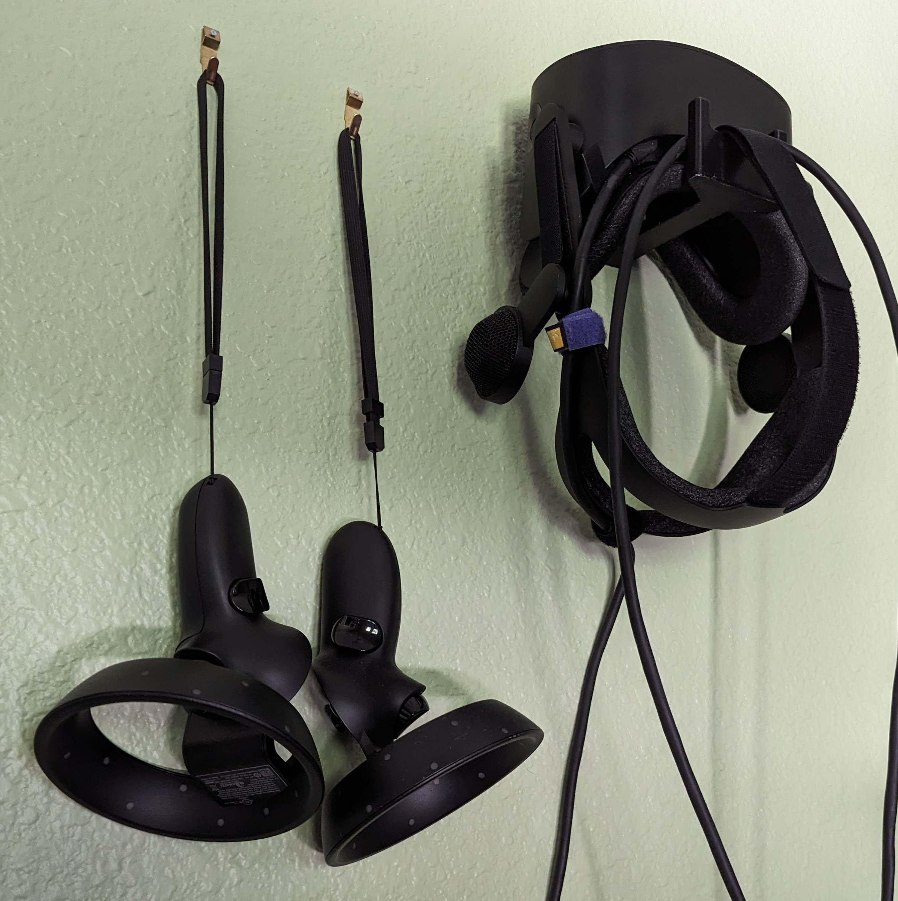

# Flight Simulator  Flight Plans

A few flight simulator flight plans as I fly around.

# Software setup

* [X-Plane-12](https://www.x-plane.com/)
* [MSFS-2020](https://www.flightsimulator.com/)
* [Pilot3ATC](https://pilot2atc.com/) - This is usually my goto for flight sim planning.

Also see:

* https://skyvector.com/
* https://www.world-airport-codes.com/
* https://www.simbrief.com/home/

# Hardware setup

* [X-Force PC](https://xforcepc.com/)
* [HP Reverb G2](https://www.hp.com/us-en/vr/reverb-vr-headset-gaming.html)
* [Honeycomb Alpha - Discontinued](https://flyhoneycomb.com/products/alpha-flight-controls) - See [Alpha flight controls XPC](https://flyhoneycomb.com/collections/honeycomb-flight-sim-hardware/products/alpha-flight-controls-xpc)
* [Honeycomb Bravo Throttle](https://flyhoneycomb.com/collections/honeycomb-flight-sim-hardware/products/bravo-throttle-quadrant)
* [CH Quadrant](https://www.chproducts.com/Throttle-Quadrant-v13-d-718.html) - I like the flip switches - handy while in VR
* [Logitech G rudders](https://www.logitechg.com/en-us/products/flight/flight-simulator-rudder-pedals.945-000024.html)
* [Wheel Stand Pro](https://wheelstandpro.com/)

# Flight Sim environment

I am a cessna 172 fan for what ever reason ;). I know the piper and cirrus
folks are probably angry at me.. what the heck, to each, their own :D

