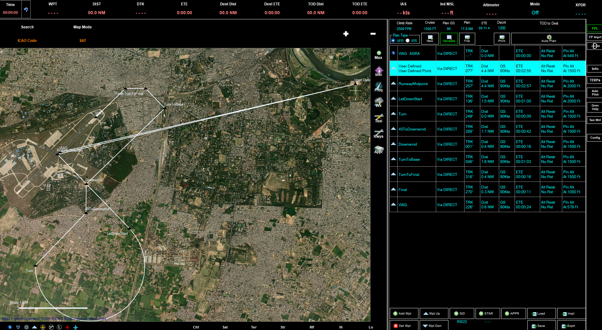

# Various Flight Plans

# Agra, India, Taj Mahal

[Taj Mahal](https://en.wikipedia.org/wiki/Taj_Mahal) is a standard location to
visit when travelling to India. So here goes a quick flight plan (first one,
lets see how this pans out)

